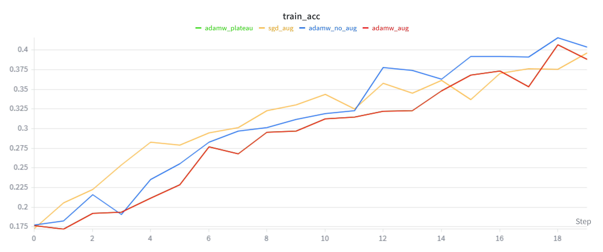
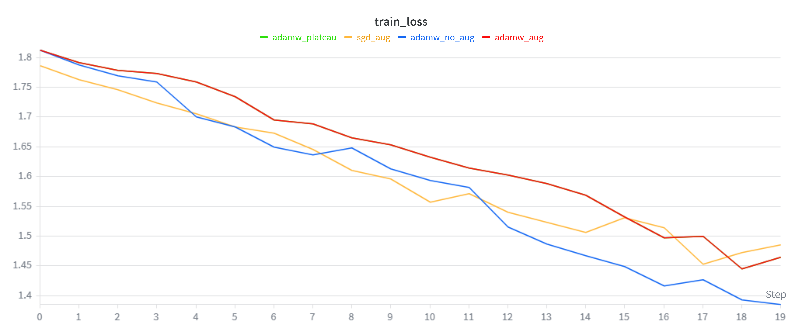
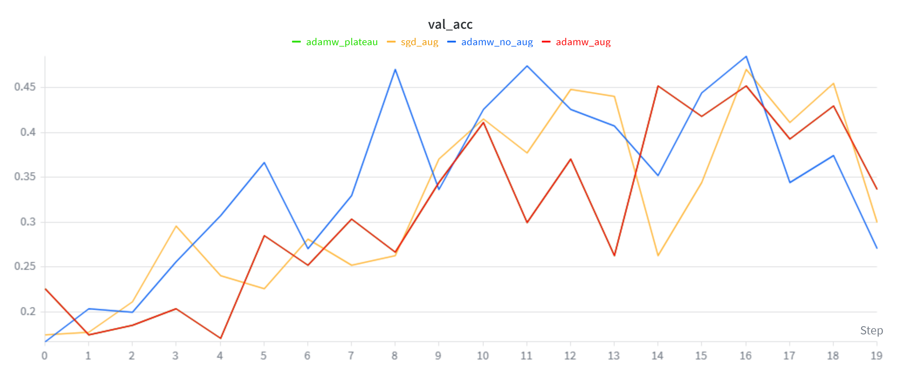
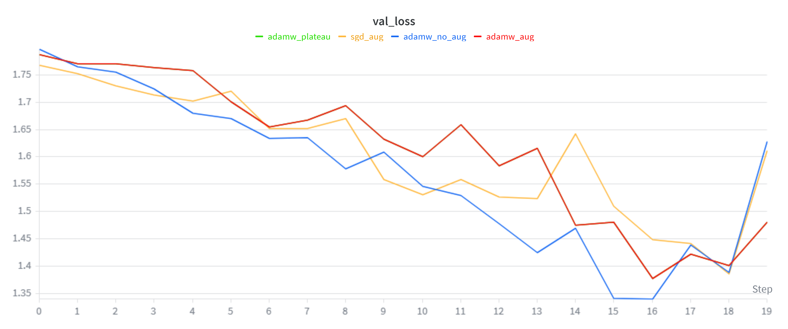
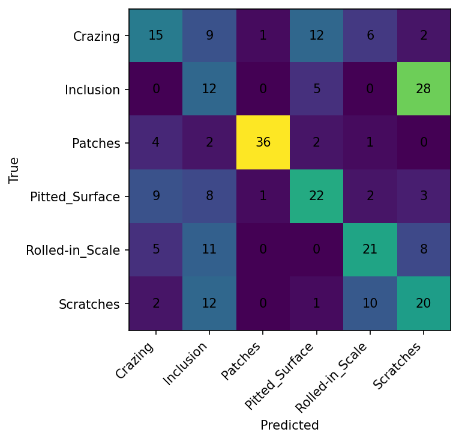
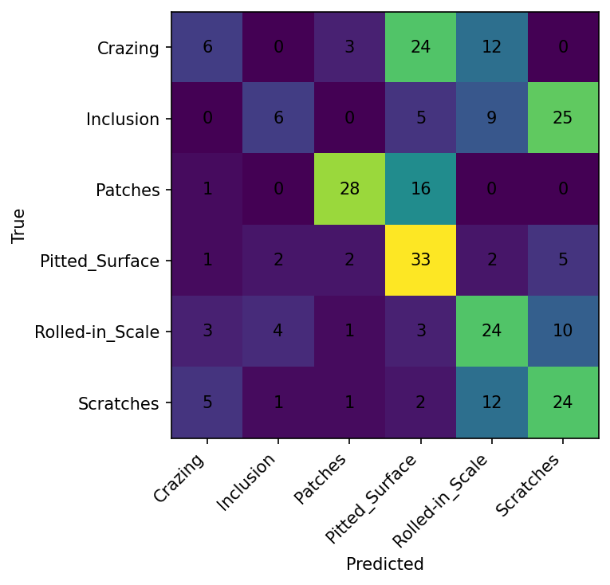
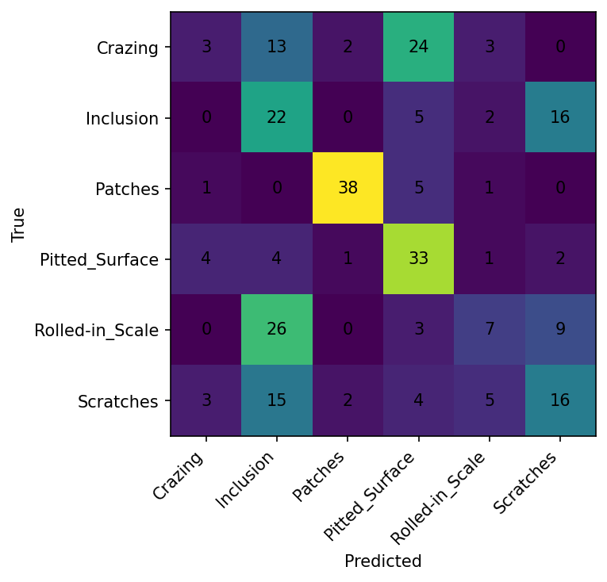

# CSC4005 – Lab 1: Training & Regularization – Báo cáo thí nghiệm

**Sinh viên:** Lưu Thanh Tùng – KHMT 1701
**Mã sinh viên:** 1771040029
**Ngày:** 16/04/2026  
**Project W&B:** [csc4005-lab1-neu-mlp](https://wandb.ai/thanhtung-contact-official-/csc4005-lab1-neu-mlp)

---

## 1. Mục tiêu

Bài lab xây dựng một pipeline huấn luyện hoàn chỉnh cho bài toán **phân loại ảnh lỗi bề mặt thép** bằng mạng nơ-ron truyền thẳng (MLP), sử dụng bộ dữ liệu **NEU Surface Defect Database** gồm 6 lớp lỗi:

| # | Loại lỗi | Mô tả |
|---|----------|-------|
| 0 | Crazing | Nứt rạn bề mặt |
| 1 | Inclusion | Tạp chất lẫn trong thép |
| 2 | Patches | Vết loang trên bề mặt |
| 3 | Pitted_Surface | Bề mặt rỗ |
| 4 | Rolled-in_Scale | Vảy cán lẫn vào |
| 5 | Scratches | Vết xước |

Mục tiêu chính:
- Hiểu quy trình huấn luyện mô hình học sâu (train / validation / test).
- So sánh các cấu hình optimizer, augmentation, scheduler.
- Theo dõi và phân tích overfitting / underfitting qua learning curves.
- Ghi lại toàn bộ quá trình bằng **Weights & Biases (W&B)**.

---

## 2. Kiến trúc mô hình

Mô hình sử dụng là **MLPClassifier** – mạng nơ-ron truyền thẳng (Multi-Layer Perceptron):

```
Input (64×64 = 4096) → Linear(4096, 512) → ReLU → Dropout(0.3)
                      → Linear(512, 256)  → ReLU → Dropout(0.3)
                      → Linear(256, 64)   → ReLU → Dropout(0.3)
                      → Linear(64, 6) → Output (6 lớp)
```

- **Kích thước ảnh đầu vào:** 64×64 pixel, grayscale, flatten thành vector 4096 chiều.
- **Hidden layers:** 3 lớp ẩn với kích thước [512, 256, 64].
- **Activation:** ReLU.
- **Regularization:** Dropout 0.3 sau mỗi lớp ẩn.
- **Loss function:** CrossEntropyLoss.
- **Dữ liệu:** chia theo tỷ lệ 70% train / 15% validation / 15% test (stratified split, seed=42).

---

## 3. Cấu hình thí nghiệm

Bốn cấu hình đã được chạy, mỗi cấu hình chỉ thay đổi **một yếu tố duy nhất** so với baseline để đảm bảo tính kiểm soát biến:

| Tham số | adamw_aug (baseline) | adamw_no_aug | sgd_aug | adamw_plateau |
|---------|---------------------|--------------|---------|---------------|
| Optimizer | AdamW | AdamW | **SGD** | AdamW |
| Learning rate | 0.001 | 0.001 | **0.01** | 0.001 |
| Weight decay | 0.0001 | 0.0001 | 0.0001 | 0.0001 |
| Dropout | 0.3 | 0.3 | 0.3 | 0.3 |
| Augmentation | ✅ Có | ❌ **Không** | ✅ Có | ✅ Có |
| Scheduler | None | None | None | **Plateau** |
| Epochs | 20 | 20 | 20 | 20 |
| Batch size | 32 | 32 | 32 | 32 |
| Img size | 64 | 64 | 64 | 64 |
| Patience | 5 | 5 | 5 | 5 |
| Device | CUDA | CUDA | CUDA | CUDA |

**Mục đích từng cấu hình:**
- **adamw_aug**: baseline chuẩn với AdamW + augmentation.
- **adamw_no_aug**: đánh giá tác động của augmentation (tắt augment).
- **sgd_aug**: so sánh optimizer SGD vs AdamW trong cùng điều kiện augment.
- **adamw_plateau**: kiểm tra hiệu quả của ReduceLROnPlateau scheduler.

---

## 4. Kết quả

### 4.1. Bảng tổng hợp metrics

| Cấu hình | Best Val Loss | Best Val Acc | Test Loss | Test Acc | Macro F1 |
|-----------|--------------|-------------|-----------|----------|----------|
| **adamw_no_aug** | **1.3396** | **48.52%** | **1.3467** | **46.67%** | **0.477** |
| sgd_aug | 1.3852 | 45.56% | 1.3514 | 44.81% | 0.420 |
| adamw_aug | 1.3775 | 45.19% | 1.3634 | 44.07% | 0.410 |
| adamw_plateau | 1.3775 | 45.19% | 1.3634 | 44.07% | 0.410 |

> **Nhận xét:** Cấu hình **adamw_no_aug** đạt kết quả tốt nhất trên cả validation set (48.52%) và test set (46.67%).

### 4.2. Learning curves

#### Train accuracy



**Nhận xét:**
- Cả 4 cấu hình đều cho train accuracy tăng dần theo epoch, cho thấy mô hình đang học được.
- **adamw_no_aug** (đường xanh dương) có train accuracy tăng nhanh nhất, đạt ~43% ở epoch cuối.
- **sgd_aug** (đường cam) khởi đầu nhanh hơn các cấu hình AdamW ở các epoch đầu.
- **adamw_aug** và **adamw_plateau** (đường đỏ và xanh lá) có đường cong gần như trùng nhau.

#### Train loss



**Nhận xét:**
- Train loss giảm đều ở cả 4 cấu hình, xác nhận quá trình học hội tụ.
- **adamw_no_aug** có train loss giảm sâu nhất (~1.39), cho thấy mô hình được tối ưu tốt hơn trên tập train khi không có augmentation.
- Các cấu hình có augmentation (adamw_aug, sgd_aug, adamw_plateau) có train loss cao hơn do dữ liệu train biến đổi qua augmentation, làm tăng độ khó.

#### Validation accuracy



**Nhận xét:**
- Đây là biểu đồ quan trọng nhất để chọn mô hình.
- **adamw_no_aug** (đường xanh dương) đạt đỉnh val accuracy cao nhất ~48.5% tại epoch 17.
- Val accuracy của tất cả các cấu hình dao động mạnh (không ổn định), đặc biệt ở nửa sau quá trình huấn luyện – dấu hiệu mô hình MLP đơn giản gặp khó khăn với bài toán phân loại ảnh phức tạp.
- **sgd_aug** (đường cam) có xu hướng tăng chậm nhưng ổn định hơn ở giai đoạn giữa.

#### Validation loss  



**Nhận xét:**
- Val loss giảm dần ở tất cả các cấu hình, cho thấy mô hình đang khái quát hóa (generalize) tốt hơn theo thời gian.
- **adamw_no_aug** đạt val loss thấp nhất (~1.34 ở epoch 17).
- Ở giai đoạn cuối (epoch 18-20), val loss của adamw_no_aug bắt đầu tăng trở lại → dấu hiệu bắt đầu overfitting.

---

### 4.3. Confusion matrix của best model (adamw_no_aug)



**Phân tích từng lớp:**
- **Patches**: nhận diện tốt nhất (36/45 đúng, precision 94.7%), đặc trưng bề mặt rõ ràng nhất.
- **Pitted_Surface**: recall khá (22/45), nhưng bị nhầm nhiều với Crazing (9 mẫu) và Inclusion (8 mẫu).
- **Rolled-in_Scale**: recall trung bình (21/45), bị nhầm nhiều với Inclusion (11 mẫu).
- **Scratches**: bị nhầm rất nhiều thành Inclusion (12 mẫu) và Rolled-in_Scale (10 mẫu).
- **Inclusion**: recall thấp (12/45), phần lớn bị nhầm thành Scratches (28 mẫu).
- **Crazing**: có cải thiện (15/45 đúng), nhưng vẫn bị nhầm nhiều với Pitted_Surface (12 mẫu).

### 4.4. Confusion matrix các cấu hình khác (để so sánh)

| adamw_aug | sgd_aug |
|-----------|---------|
|  |  |

| adamw_plateau | |
|---------------|---|
|  | |

**So sánh confusion matrix:**
- Các cấu hình có augmentation (adamw_aug, sgd_aug, adamw_plateau) phân loại **Crazing** rất kém (chỉ 3-6/45 đúng), trong khi adamw_no_aug đạt 15/45.
- **Patches** và **Pitted_Surface** được nhận diện tốt ở tất cả các cấu hình nhờ đặc trưng hình ảnh đặc trưng.
- **Inclusion** và **Scratches** là hai lớp khó phân biệt nhất ở mọi cấu hình, do đặc trưng hình ảnh tương tự nhau khi flatten thành vector.

---

### 4.5. Classification report của best model (adamw_no_aug)

| Lớp | Precision | Recall | F1-score | Support |
|-----|-----------|--------|----------|---------|
| Crazing | 0.429 | 0.333 | 0.375 | 45 |
| Inclusion | 0.222 | 0.267 | 0.242 | 45 |
| Patches | **0.947** | **0.800** | **0.867** | 45 |
| Pitted_Surface | 0.524 | 0.489 | 0.506 | 45 |
| Rolled-in_Scale | 0.525 | 0.467 | 0.494 | 45 |
| Scratches | 0.328 | 0.444 | 0.377 | 45 |
| **Macro avg** | **0.496** | **0.467** | **0.477** | 270 |

---

## 5. Phân tích

### 5.1. Tác động của augmentation

So sánh **adamw_aug** vs **adamw_no_aug** (cùng optimizer, chỉ khác augmentation):

| Metric | adamw_aug | adamw_no_aug | Chênh lệch |
|--------|-----------|--------------|-------------|
| Best Val Acc | 45.19% | **48.52%** | +3.33% |
| Test Acc | 44.07% | **46.67%** | +2.60% |
| Macro F1 | 0.410 | **0.477** | +0.067 |

**Kết luận:** Trong trường hợp này, **augmentation không cải thiện hiệu suất** mà còn làm giảm. Nguyên nhân có thể là:
- Mô hình MLP flatten ảnh thành vector, **mất hoàn toàn thông tin không gian** (spatial information). Khi augmentation xoay hay dịch ảnh, các pixel bị đảo vị trí trong vector → mô hình MLP không thể học được augmentation hiệu quả như CNN.
- Augmentation tăng độ khó của tập train, nhưng mô hình MLP đơn giản thiếu khả năng biểu diễn (representation capacity) để tận dụng lợi ích này.

### 5.2. So sánh optimizer: AdamW vs SGD

So sánh **adamw_aug** vs **sgd_aug** (cùng augmentation, chỉ khác optimizer):

| Metric | adamw_aug (lr=0.001) | sgd_aug (lr=0.01) | Chênh lệch |
|--------|---------------------|-------------------|-------------|
| Best Val Acc | 45.19% | **45.56%** | +0.37% |
| Test Acc | 44.07% | **44.81%** | +0.74% |
| Macro F1 | 0.410 | **0.420** | +0.010 |

**Kết luận:**
- SGD với momentum 0.9 và learning rate 0.01 đạt kết quả **nhỉnh hơn nhẹ** so với AdamW ở lr=0.001 trong bối cảnh có augmentation.
- Tuy nhiên, sự khác biệt rất nhỏ (~0.7%) và **không có ý nghĩa thống kê rõ ràng** với chỉ 1 lần chạy.
- Từ biểu đồ train_acc, SGD khởi đầu nhanh hơn ở các epoch đầu nhờ learning rate cao hơn.

### 5.3. Tác động của scheduler (ReduceLROnPlateau)

So sánh **adamw_aug** vs **adamw_plateau** (cùng mọi thứ, chỉ thêm scheduler):

| Metric | adamw_aug | adamw_plateau |
|--------|-----------|---------------|
| Best Val Acc | 45.19% | 45.19% |
| Test Acc | 44.07% | 44.07% |

**Kết luận:** Scheduler ReduceLROnPlateau **không tạo sự khác biệt** trong thí nghiệm này. Learning rate chỉ giảm 1 lần (từ 0.001 xuống 0.0005) ở epoch 20 cuối cùng – quá muộn để có tác dụng. Với 20 epoch, mô hình chưa đủ thời gian hội tụ để scheduler phát huy hiệu quả.

### 5.4. Overfitting và underfitting

**Dấu hiệu underfitting (chiếm ưu thế):**
- Cả train accuracy (~40%) lẫn val accuracy (~45-48%) đều **còn rất thấp** – mô hình chưa học đủ tốt.
- Train loss vẫn còn cao (~1.39-1.47) sau 20 epoch, chưa hội tụ hoàn toàn.
- Nguyên nhân chính: mô hình MLP quá đơn giản cho bài toán nhận diện ảnh – việc flatten ảnh mất hết thông tin không gian, khiến mô hình không thể nắm bắt các mẫu hình cục bộ (local patterns) quan trọng cho phân loại lỗi.

**Dấu hiệu overfitting nhẹ (ở adamw_no_aug):**
- Từ biểu đồ val_loss: val loss bắt đầu **tăng trở lại** ở epoch 18-20 trong khi train loss tiếp tục giảm.
- Khoảng cách train_acc (40.4%) vs val_acc (48.5%) không quá lớn, nhưng xu hướng val loss tăng cho thấy mô hình bắt đầu ghi nhớ tập train.
- Đặc biệt, adamw_no_aug (không có augmentation) dễ overfit hơn vì không có regularization từ augmentation.

---

## 6. W&B dashboard

Link W&B dashboard: [https://wandb.ai/thanhtung-contact-official-/csc4005-lab1-neu-mlp](https://wandb.ai/thanhtung-contact-official-/csc4005-lab1-neu-mlp)

Tất cả 4 cấu hình đã được log đầy đủ trên W&B, bao gồm:
- Learning curves (train_loss, val_loss, train_acc, val_acc) theo từng epoch.
- Confusion matrix image.
- Curves image.
- Config hyperparameters.
- Best metrics (best_val_acc, best_val_loss, test_acc, test_loss).

---

## 7. Kết luận

### 7.1. Best model: `adamw_no_aug`

Cấu hình tốt nhất được chọn là **adamw_no_aug** với các lý do:

1. **Val accuracy cao nhất** (48.52%) – tiêu chí đầu tiên để chọn best model.
2. **Val loss thấp nhất** (1.3396) – cho thấy khả năng khái quát hóa tốt nhất.
3. **Test accuracy cao nhất** (46.67%) – xác nhận khả năng khái quát trên dữ liệu chưa thấy.
4. **Macro F1 cao nhất** (0.477) – hiệu suất cân bằng hơn giữa các lớp.
5. **Confusion matrix cân bằng hơn** – phân loại được Crazing tốt hơn hẳn (15/45 vs 3-6/45 ở các cấu hình khác).

### 7.2. Bài học rút ra

| Bài học | Chi tiết |
|---------|----------|
| MLP không phù hợp cho ảnh | Flatten ảnh mất thông tin không gian, accuracy tối đa chỉ ~47%. CNN sẽ phù hợp hơn nhiều. |
| Augmentation cần phải phù hợp kiến trúc | Augmentation (xoay, dịch) không giúp ích cho MLP vì MLP xử lý từng pixel độc lập, không có khái niệm "vùng lân cận". |
| Thí nghiệm có kiểm soát rất quan trọng | Chỉ thay đổi 1 yếu tố mỗi lần giúp xác định chính xác nguyên nhân thay đổi kết quả. |
| Scheduler cần đủ epoch | ReduceLROnPlateau chỉ hiệu quả khi training đủ lâu để loss plateau rõ ràng. |
| Không chọn model theo train accuracy | Model tốt nhất phải dựa trên **validation set**, không phải train set. |

### 7.3. Hướng cải thiện

- Sử dụng **CNN** (Convolutional Neural Network) để giữ thông tin không gian của ảnh.
- Tăng số epoch và điều chỉnh learning rate phù hợp.
- Áp dụng augmentation phù hợp hơn với CNN (random crop, horizontal flip, color jitter).
- Thử nghiệm với kích thước ảnh lớn hơn (128×128 hoặc 200×200) để giữ nhiều chi tiết hơn.
